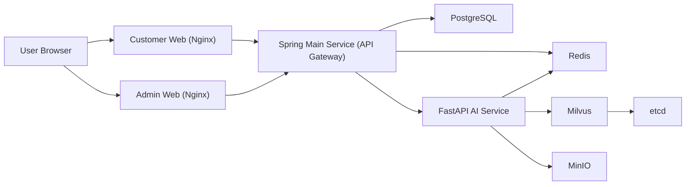

# ChemiLog

ChemiLog는 식단 기록, 식품 첨가물 관리, AI 멘토링을 통합한 B2C 헬스케어 플랫폼입니다.  
본 저장소는 Customer Web, Admin Web, Spring Main API, FastAPI AI 서비스를 Docker Compose로 통합 실행할 수 있도록 구성되어 있습니다.

## 1. 프로젝트 개요
- 프로젝트명: ChemiLog
- 목적: 사용자의 식단/첨가물 노출 데이터를 기반으로 개인화된 영양 관리와 AI 멘토링 제공
- 아키텍처: MSA (Web / Main API / AI / Data 계층 분리)

## 2. 프로젝트 디렉토리
```text
ChemiLog/
├─ frontend/
│  ├─ customer-web/                  # 사용자 웹 (Vue 3 + Vite + Pinia)
│  └─ admin-web/                     # 관리자 웹 (Vue 3 + Vite + Pinia)
├─ backend/
│  └─ main-service/                  # Spring Boot 메인 API Gateway + 비즈니스 로직
├─ ai-service/                       # FastAPI AI 서비스 (Policy/Persona/RAG/Quality)
├─ docs/
│  ├─ spring-openapi.json            # Spring OpenAPI 스펙
│  └─ fastapi-openapi.json           # FastAPI OpenAPI 스펙
├─ infra/                            # 인프라 관련 설정/보조 파일
├─ docker-compose.yml
├─ .env.example
├─ .gitignore
└─ README.md
```

## 3. 기술 스택
### Frontend
- Vue 3 (Composition API)
- Vite
- Pinia
- TailwindCSS
- Axios

### Backend (Main)
- Java 17
- Spring Boot 3.x
- Spring Security (JWT)
- Spring Data JPA / Hibernate
- PostgreSQL

### Backend (AI)
- Python 3.11+
- FastAPI
- Uvicorn
- OpenAI API
- Redis / Milvus 연동

### Infra
- Docker Compose
- Nginx
- Redis 7
- Milvus 2.3
- MinIO
- etcd

## 4. 서비스 구조도


## 5. 사전 준비
- Docker Desktop
- Git
- (선택) Node.js 20+ / npm
- (선택) Java 17 / Maven
- (선택) Python 3.11+

## 6. 환경변수 준비
```powershell
copy .env.example .env
```

최소 필수 확인값:
- `POSTGRES_PASSWORD`
- `JWT_SECRET`
- `INTERNAL_API_SECRET`
- `OPENAI_API_KEY`

포트는 `.env`에서 조정 가능합니다:
- `CUSTOMER_WEB_PORT`
- `ADMIN_WEB_PORT`
- `SPRING_MAIN_PORT`

## 7. 실행 방법 (권장: Docker Compose)
### 7.1 저장소 클론
```powershell
git clone https://github.com/yangbun-GIT/ChemiLog.git
cd ChemiLog
```

### 7.2 전체 빌드/실행
```powershell
docker compose up -d --build
```

### 7.3 실행 상태 확인
```powershell
docker compose ps
```

### 7.4 종료
```powershell
docker compose down
```

## 8. 접속 주소
아래 URL은 `.env` 포트 설정값에 따라 달라질 수 있습니다.
- Customer Web: `http://localhost:${CUSTOMER_WEB_PORT}`
- Admin Web: `http://localhost:${ADMIN_WEB_PORT}`
- Spring API: `http://localhost:${SPRING_MAIN_PORT}`
- Spring Swagger UI: `http://localhost:${SPRING_MAIN_PORT}/swagger-ui/index.html`

예시(현재 로컬 설정):
- Customer Web: [http://localhost:3320](http://localhost:3320)
- Admin Web: [http://localhost:3321](http://localhost:3321)
- Spring API: [http://localhost:18081](http://localhost:18081)

## 9. 로컬 개발용 빌드 (선택)
### Frontend
```powershell
npm --prefix .\frontend\customer-web install
npm --prefix .\frontend\admin-web install
npm --prefix .\frontend\customer-web run build
npm --prefix .\frontend\admin-web run build
```

### Spring Main
```powershell
mvn -f .\backend\main-service\pom.xml -DskipTests package
```

### FastAPI
```powershell
cd ai-service
uv sync
uv run uvicorn app.main:app --host 0.0.0.0 --port 8000
```

## 10. 기본 계정
- Admin: `admin@chemilog.com` / `Admin1234!`
- User: `user@chemilog.com` / `User1234!`
- Premium: `premium@chemilog.com` / `Premium1234!`

## 11. Swagger/OpenAPI 산출물
저장소에 제출용 OpenAPI JSON이 포함되어 있습니다.
- Spring OpenAPI: [`docs/spring-openapi.json`](docs/spring-openapi.json)
- FastAPI OpenAPI: [`docs/fastapi-openapi.json`](docs/fastapi-openapi.json)

갱신 방법:
1. Spring 서비스 기동 후 `/v3/api-docs` 응답을 `docs/spring-openapi.json`으로 저장
2. FastAPI 서비스 기동 후 `/openapi.json` 응답을 `docs/fastapi-openapi.json`으로 저장

## 12. 보안/제출 주의사항
- `.env`, `node_modules/`, `.venv/`, `.idea/`, `__pycache__/`, 인증서/키 파일(`*.pem`, `*.key`)은 Git에 포함하지 않습니다.
- 민감값은 `.env`에만 두고, 저장소에는 `.env.example`만 유지합니다.
