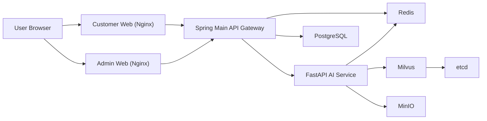

# ChemiLog 프로젝트 안내서

ChemiLog는 식단 기록, 첨가물 추적, AI 영양 멘토링을 제공하는 B2C 헬스케어 웹 플랫폼입니다.

## 1. 기술 스택
- Customer Web: Vue 3, Vite, Pinia, TailwindCSS
- Admin Web: Vue 3, Vite, TailwindCSS
- Main Backend: Java 17, Spring Boot 3, Spring Security, JPA, Flyway
- AI Backend: Python 3.11, FastAPI, uv
- Infra: Docker Compose, PostgreSQL, Redis, Milvus, MinIO, Nginx

## 2. 서비스 구조도


## 3. 프로젝트 디렉토리
```text
ChemiLog/
├─ frontend/
│  ├─ customer-web/
│  └─ admin-web/
├─ backend/
│  └─ main-service/
├─ ai-service/
├─ docs/
│  ├─ swagger.md
│  └─ submission-guide.md
├─ docker-compose.yml
├─ .env.example
├─ .gitignore
├─ package.json
└─ uv.lock
```

## 4. 사전 준비

### 4.1 필수 도구
- Docker Desktop
- Git
- (선택) Node.js 20+, npm
- (선택) Java 17, Maven
- (선택) Python 3.11+

### 4.2 환경변수 파일 생성
```powershell
copy .env.example .env
```

최소 수정 권장 항목:
- `POSTGRES_PASSWORD`
- `JWT_SECRET`
- `INTERNAL_API_SECRET`
- `OPENAI_API_KEY`

## 5. 설치/빌드/실행 (한 번에)

### 5.1 Docker 기준 (권장)
```powershell
docker compose up -d --build
docker compose ps
```

### 5.2 접속 주소
포트는 `.env` 값 기준으로 달라집니다.

- Customer Web: `http://localhost:${CUSTOMER_WEB_PORT}`
- Admin Web: `http://localhost:${ADMIN_WEB_PORT}`
- Spring API: `http://localhost:${SPRING_MAIN_PORT}`
- Spring Swagger UI: `http://localhost:${SPRING_MAIN_PORT}/swagger-ui.html`
- Spring OpenAPI JSON: `http://localhost:${SPRING_MAIN_PORT}/api-docs`

예시(자주 쓰는 로컬 포트):
- Customer: [http://localhost:3000](http://localhost:3000)
- Admin: [http://localhost:3001](http://localhost:3001)
- Spring: [http://localhost:18081](http://localhost:18081)

### 5.3 프론트엔드 로컬 빌드 (선택)
```powershell
npm --prefix .\frontend\customer-web install
npm --prefix .\frontend\admin-web install
npm --prefix .\frontend\customer-web run build
npm --prefix .\frontend\admin-web run build
```

### 5.4 백엔드 로컬 빌드 (선택)
```powershell
mvn -f .\backend\main-service\pom.xml -DskipTests package
```

## 6. 개발/테스트 기본 계정
- Admin: `admin@chemilog.com` / `Admin1234!`
- User: `user@chemilog.com` / `User1234!`
- Premium: `premium@chemilog.com` / `Premium1234!`

## 7. Swagger 확인 및 제출 방법

### 7.1 Spring Swagger
- Swagger UI: [http://localhost:18081/swagger-ui.html](http://localhost:18081/swagger-ui.html)
- OpenAPI JSON: [http://localhost:18081/api-docs](http://localhost:18081/api-docs)

### 7.2 FastAPI Swagger
기본 compose 설정에서는 FastAPI가 외부 포트 publish가 없어서 브라우저 직접 접근이 제한될 수 있습니다.
- 내부 문서 URL: `http://fastapi-service:8000/docs`
- OpenAPI JSON: `http://fastapi-service:8000/openapi.json`

필요 시 일시적으로 fastapi 포트 publish 후 확인합니다.

### 7.3 과제 제출용 Swagger 파일 추출
Spring OpenAPI JSON 파일 저장:
```powershell
Invoke-WebRequest -Uri http://localhost:18081/api-docs -OutFile .\docs\spring-openapi.json
```

FastAPI OpenAPI JSON 파일 저장(포트 publish 한 경우):
```powershell
Invoke-WebRequest -Uri http://localhost:8000/openapi.json -OutFile .\docs\fastapi-openapi.json
```

제출 시 권장:
- `README.md`
- `docs/swagger.md`
- `docs/spring-openapi.json`
- (가능하면) `docs/fastapi-openapi.json`

## 8. 실제 DB 데이터 화면 캡처 방법

### 방법 A: psql 콘솔 화면 캡처 (가장 간단)
1) PostgreSQL 접속
```powershell
docker exec -it chemilog-postgres-1 psql -U chemilog_user -d chemilog
```

2) 테이블/데이터 조회
```sql
\dt
SELECT user_id, email, role, status FROM users ORDER BY user_id;
SELECT meal_id, user_id, meal_date, meal_type, total_calories
FROM meals
ORDER BY meal_id DESC
LIMIT 20;
SELECT food_id, name, calories
FROM food_items
ORDER BY food_id DESC
LIMIT 20;
```

3) 결과가 보이는 터미널을 캡처해서 제출

### 방법 B: CSV 추출 후 엑셀 캡처
```powershell
docker exec chemilog-postgres-1 psql -U chemilog_user -d chemilog -c "COPY (SELECT meal_id, user_id, meal_date, meal_type, total_calories FROM meals ORDER BY meal_id DESC LIMIT 20) TO STDOUT WITH CSV HEADER" > .\docs\meals-sample.csv
```
`docs/meals-sample.csv`를 엑셀로 열어 캡처합니다.

## 9. 제출 시 node_modules 제외 방법

### 9.1 현재 node_modules 위치
- `C:\Users\yangbun\Documents\OSS\ChemiLog\frontend\customer-web\node_modules`
- `C:\Users\yangbun\Documents\OSS\ChemiLog\frontend\admin-web\node_modules`

### 9.2 제출 직전 삭제 명령
```powershell
Remove-Item -Recurse -Force .\frontend\customer-web\node_modules
Remove-Item -Recurse -Force .\frontend\admin-web\node_modules
```

### 9.3 다시 개발할 때 복구
```powershell
npm --prefix .\frontend\customer-web install
npm --prefix .\frontend\admin-web install
```

## 10. GitHub 업로드 금지 항목 체크
`.gitignore`에 반영된 주요 항목:
- `.env`, `.env.*` (`.env.example` 제외)
- `node_modules/`
- `.venv/`
- `.idea/`
- `__pycache__/`
- `*.pem`, `*.key`, `*.crt`, `*.jks`

추적 여부 확인:
```powershell
git ls-files | Select-String -Pattern "(^|/)\.env$|(^|/)node_modules/|(^|/)\.venv/|\.idea/|__pycache__|\.pem$|\.key$|\.crt$|\.jks$"
```

출력이 없으면 정상입니다.

## 11. AI API 동작 점검 (키 입력 후)
1) `.env`에 `OPENAI_API_KEY` 입력
2) 재기동
```powershell
docker compose up -d --build
```
3) 사용자 로그인 후 Customer Web 우하단 AI 위젯에서 질문
4) 관리자 로그에서 Policy/Hallucination 확인

---
롤백 안내: 디자인/기능 변경이 마음에 들지 않으면 특정 커밋으로 롤백 가능합니다.
