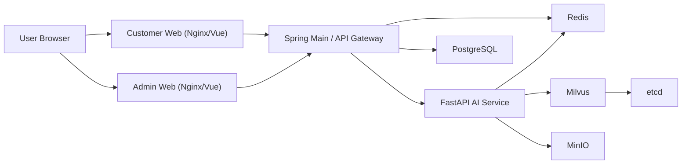

# ChemiLog

ChemiLog는 식품 첨가물 추적과 식단 기록/멘토링을 제공하는 B2C 헬스케어 MSA 프로젝트입니다.  
고객용 웹(Customer Web), 관리자 웹(Admin CMS), 메인 백엔드(Spring Boot), AI 백엔드(FastAPI), 데이터 계층(PostgreSQL/Redis/Milvus/MinIO)을 Docker Compose로 통합 실행합니다.

## 1) 프로젝트 구조

```text
ChemiLog/
├─ frontend/
│  ├─ customer-web/        # Vue3 + Pinia + Vite
│  └─ admin-web/           # Vue3 + Vite
├─ backend/
│  └─ main-service/        # Java 17 + Spring Boot 3.x
├─ ai-service/             # Python 3.11 + FastAPI
├─ docs/
│  ├─ swagger.md           # Swagger/OpenAPI 문서 가이드
│  └─ submission-guide.md  # 제출/DB 캡처 가이드
├─ docker-compose.yml
├─ .env.example
└─ .gitignore
```

## 2) 서비스 구조도



## 3) 기술 스택

- Frontend: Vue 3, Pinia, Vite, TailwindCSS
- Main Backend: Java 17, Spring Boot 3.x, Spring Security, Spring Data JPA, Flyway
- AI Backend: Python 3.11+, FastAPI, uv
- Infra: Docker Compose, Nginx, PostgreSQL, Redis, Milvus, MinIO, etcd

## 4) 실행 방법

### 4-1. 환경 변수 준비

```powershell
copy .env.example .env
```

최소 수정 권장 항목:
- `JWT_SECRET`
- `POSTGRES_PASSWORD`
- `INTERNAL_API_SECRET`
- `OPENAI_API_KEY` (AI 멘토링 실사용 시 필수)

### 4-2. 전체 서비스 실행

```powershell
docker compose up -d --build
docker compose ps
```

### 4-3. 접속 주소

- Customer Web: `http://localhost:3000`
- Admin Web: `http://localhost:3001`
- Spring API(호스트): `http://localhost:18081`
- Spring Swagger UI: `http://localhost:18081/swagger-ui.html`
- Spring OpenAPI JSON: `http://localhost:18081/api-docs`
- FastAPI Docs(내부 컨테이너): `http://localhost:8000/docs`  
  - 기본 compose 구성은 `fastapi-service`를 host에 직접 publish하지 않으므로, 외부 브라우저에서 바로 접속하려면 별도 포트 바인딩이 필요합니다.

## 5) 개발/빌드

루트 빌드:

```powershell
npm run build
```

개별 빌드:

```powershell
npm --prefix .\frontend\customer-web run build
npm --prefix .\frontend\admin-web run build
```

AI 서비스 문법 체크:

```powershell
uv --directory .\ai-service run python -m compileall app
```

## 6) 초기 계정(개발 시드)

- Admin: `admin@chemilog.com` / `Admin1234!`
- User: `user@chemilog.com` / `User1234!`
- Premium: `premium@chemilog.com` / `Premium1234!`

## 7) 문서

- Swagger 문서 가이드: [docs/swagger.md](./docs/swagger.md)
- 제출/DB 캡처 가이드: [docs/submission-guide.md](./docs/submission-guide.md)

## 8) 보안/커밋 정책 요약

다음 파일/폴더는 커밋 금지:
- `.env`, `.env.*` (단, `.env.example` 허용)
- `node_modules/`
- `.venv/`
- `.idea/`
- `__pycache__/`
- `*.pem`, `*.key` 등 인증서/키 파일

`.gitignore`로 차단되어 있으며, 커밋 전 `git status` / `git ls-files`로 반드시 확인하세요.
