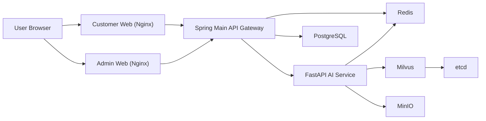

# ChemiLog

## 1. 프로젝트명
ChemiLog

## 2. 프로젝트 목적
ChemiLog는 사용자의 식단 기록 데이터를 기반으로 식품 첨가물 노출과 영양 밸런스를 관리하고,
AI 멘토링을 통해 개인 맞춤형 식단 피드백을 제공하는 B2C 헬스케어 플랫폼입니다.

## 3. 프로젝트 디렉토리
```text
ChemiLog/
├─ frontend/
│  ├─ customer-web/        # 사용자 웹(Vue3 + Vite)
│  └─ admin-web/           # 관리자 웹(Vue3 + Vite)
├─ backend/
│  └─ main-service/        # Spring Boot API Gateway + Core Business
├─ ai-service/             # FastAPI AI/RAG Service
├─ infra/                  # 인프라 관련 설정 파일
├─ docker-compose.yml
├─ .env.example
├─ .gitignore
└─ README.md
```

## 4. 사용 기술 스택

### Frontend
- Vue 3 (Composition API)
- Vite
- Pinia
- TailwindCSS
- Axios

### Backend (Main)
- Java 17
- Spring Boot 3.x
- Spring Security (JWT)
- Spring Data JPA / Hibernate
- Flyway

### Backend (AI)
- Python 3.11+
- FastAPI
- uv
- OpenAI API 연동

### Infra / Data
- Docker Compose
- PostgreSQL 15
- Redis 7
- Milvus 2.3
- MinIO
- Nginx

## 5. 서비스 구조도


## 6. 사전 준비
- Docker Desktop
- Git
- (선택) Node.js 20+, npm
- (선택) Java 17, Maven
- (선택) Python 3.11+

환경변수 파일 생성:
```powershell
copy .env.example .env
```

최소 수정 권장 항목:
- `POSTGRES_PASSWORD`
- `JWT_SECRET`
- `INTERNAL_API_SECRET`
- `OPENAI_API_KEY`

## 7. 프로젝트 다운로드 및 빌드/실행 방법

### 7.1 프로젝트 다운로드
```powershell
git clone https://github.com/yangbun-GIT/ChemiLog.git
cd ChemiLog
```

### 7.2 Docker 전체 빌드/실행 (권장)
```powershell
docker compose up -d --build
docker compose ps
```

### 7.3 접속 주소
- Customer Web: `http://localhost:3000`
- Admin Web: `http://localhost:3001`
- Spring API: `http://localhost:18081`

### 7.4 로컬 프론트 빌드 (선택)
```powershell
npm --prefix .\frontend\customer-web install
npm --prefix .\frontend\admin-web install
npm --prefix .\frontend\customer-web run build
npm --prefix .\frontend\admin-web run build
```

### 7.5 로컬 백엔드 빌드 (선택)
```powershell
mvn -f .\backend\main-service\pom.xml -DskipTests package
```

## 8. 개발/테스트 기본 계정
- Admin: `admin@chemilog.com` / `Admin1234!`
- User: `user@chemilog.com` / `User1234!`
- Premium: `premium@chemilog.com` / `Premium1234!`
