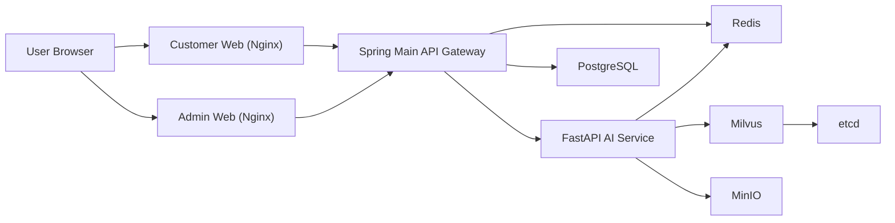

# ChemiLog

ChemiLog는 식단 기록, 첨가물 추적, AI 멘토링을 제공하는 B2C 헬스케어 웹 플랫폼입니다.

## 1. 프로젝트 개요

- Customer Web: Vue 3 + Pinia + Vite + TailwindCSS
- Admin Web: Vue 3 + Vite + TailwindCSS
- Main Backend: Java 17 + Spring Boot 3 + JPA + Spring Security
- AI Backend: Python 3.11 + FastAPI + uv
- Infra: Docker Compose + PostgreSQL + Redis + Milvus + MinIO + Nginx

## 2. 서비스 구조



## 3. 디렉토리 구조

```text
ChemiLog/
|- frontend/
|  |- customer-web/
|  `- admin-web/
|- backend/
|  `- main-service/
|- ai-service/
|- docs/
|  |- swagger.md
|  `- submission-guide.md
|- docker-compose.yml
|- .env.example
`- .gitignore
```

## 4. 실행 방법

### 4.1 환경 변수 준비

```powershell
copy .env.example .env
```

권장 수정 항목:
- `JWT_SECRET`
- `POSTGRES_PASSWORD`
- `INTERNAL_API_SECRET`
- `OPENAI_API_KEY` (AI API 실테스트 시 필요)

### 4.2 컨테이너 실행

```powershell
docker compose up -d --build
docker compose ps
```

### 4.3 접속 주소

- 고객 웹: `http://localhost:3000`
- 관리자 웹: `http://localhost:3001`
- Spring API: `http://localhost:18081`
- Spring Swagger UI: `http://localhost:18081/swagger-ui.html`
- Spring OpenAPI JSON: `http://localhost:18081/api-docs`

## 5. 개발용 계정

- Admin: `admin@chemilog.com` / `Admin1234!`
- User: `user@chemilog.com` / `User1234!`
- Premium: `premium@chemilog.com` / `Premium1234!`

## 6. 문서

- Swagger 안내: [docs/swagger.md](./docs/swagger.md)
- 과제 제출 안내: [docs/submission-guide.md](./docs/submission-guide.md)

## 7. Git 업로드 금지 파일

다음 파일/폴더는 Git에 올리면 안 됩니다.

- `.env`, `.env.*` (`.env.example` 제외)
- `node_modules/`
- `.venv/`
- `.idea/`
- `__pycache__/`
- `*.pem`, `*.key`, `*.crt`, `*.jks`

현재 저장소의 `.gitignore`에 위 항목이 반영되어 있습니다.
