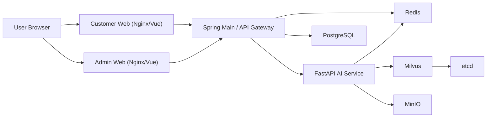

# ChemiLog

ChemiLog는 식품 첨가물 추적과 AI 영양 멘토링을 제공하는 MSA 기반 B2C 헬스케어 플랫폼입니다.

## 아키텍처


## 기술 스택
- Customer/Admin Web: Vue 3, Pinia, Vite, TailwindCSS
- Main Backend: Java 17, Spring Boot 3.x, Spring Security, JPA, Flyway
- AI Backend: Python 3.11+, FastAPI, uv
- Infra: Docker Compose, PostgreSQL, Redis, Milvus, MinIO, etcd

## 환경 변수
1. `.env` 파일이 필요합니다.
2. 기본 템플릿:
```powershell
copy .env.example .env
```
3. 최소 수정 권장 값:
- `JWT_SECRET`
- `POSTGRES_PASSWORD`
- `INTERNAL_API_SECRET`
- `OPENAI_API_KEY` (비워두면 AI는 폴백 응답 모드로 동작)

## 로컬 실행
```powershell
docker compose up -d --build
docker compose ps
```

## 접속 URL
- Customer Web: `http://localhost:3000`
- Admin Web: `http://localhost:3001`
- Spring API: `http://localhost:8081`
- Spring Swagger: `http://localhost:8081/swagger-ui.html`
- FastAPI Docs (내부망 서비스): `http://localhost:8000/docs` (직접 포트 바인딩 시에만 접근)

## 개발용 로그인 계정 (Seed)
- Admin: `admin@chemilog.com` / `Admin1234!`
- User: `user@chemilog.com` / `User1234!`
- Premium: `premium@chemilog.com` / `Premium1234!`

## 빌드
루트에서 프론트 전체 빌드:
```powershell
npm run build
```

개별 빌드:
```powershell
npm --prefix .\frontend\customer-web run build
npm --prefix .\frontend\admin-web run build
```

AI 컴파일 체크:
```powershell
uv --directory .\ai-service run python -m compileall app
```

## 데이터베이스 초기화
- Flyway가 앱 기동 시 자동으로 마이그레이션을 수행합니다.
- 포함된 마이그레이션:
  - `V1__init_schema.sql`: 핵심 스키마 생성
  - `V2__seed_dev_data.sql`: 개발용 계정/식품/첨가물 시드 데이터

## 자주 발생하는 이슈
- 루트에서 `npm run build` 시 `package.json` 없음:
  - 해결: 루트 `package.json`이 포함되어 있으므로 최신 코드 기준으로는 정상 동작
- `uv run python -m compileall app`에서 `Can't list 'app'`:
  - 해결: `ai-service` 디렉토리에서 실행하거나 `uv --directory .\ai-service ...` 사용
