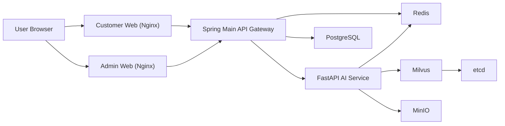

# ChemiLog

ChemiLog is a B2C healthcare web platform for meal logging, food additive tracking, and AI mentoring.

## 1. Project Summary

- Customer Web: Vue 3 + Pinia + Vite + TailwindCSS
- Admin Web: Vue 3 + Vite + TailwindCSS
- Main Backend: Java 17 + Spring Boot 3 + JPA + Spring Security
- AI Backend: Python 3.11 + FastAPI + uv
- Infra: Docker Compose + PostgreSQL + Redis + Milvus + MinIO + Nginx

## 2. Service Architecture



## 3. Directory Layout

```text
ChemiLog/
|- frontend/
|  |- customer-web/
|  `- admin-web/
|- backend/
|  `- main-service/
|- ai-service/
|- docs/
|  |- swagger.md
|  `- submission-guide.md
|- docker-compose.yml
|- .env.example
`- .gitignore
```

## 4. Run Locally

### 4.1 Prepare Environment

```powershell
copy .env.example .env
```

Recommended edits:
- `JWT_SECRET`
- `POSTGRES_PASSWORD`
- `INTERNAL_API_SECRET`
- `OPENAI_API_KEY` (required for real AI API test)

### 4.2 Start Containers

```powershell
docker compose up -d --build
docker compose ps
```

### 4.3 URLs

- Customer Web: `http://localhost:3000`
- Admin Web: `http://localhost:3001`
- Spring API: `http://localhost:18081`
- Spring Swagger UI: `http://localhost:18081/swagger-ui.html`
- Spring OpenAPI JSON: `http://localhost:18081/api-docs`

## 5. Dev Accounts

- Admin: `admin@chemilog.com` / `Admin1234!`
- User: `user@chemilog.com` / `User1234!`
- Premium: `premium@chemilog.com` / `Premium1234!`

## 6. API Docs

- Swagger guide: [docs/swagger.md](./docs/swagger.md)

## 7. Submission Guide

- Submission and DB capture guide: [docs/submission-guide.md](./docs/submission-guide.md)

## 8. Security and Excluded Files

Do not commit:
- `.env`, `.env.*` (`.env.example` is allowed)
- `node_modules/`
- `.venv/`
- `.idea/`
- `__pycache__/`
- `*.pem`, `*.key`, `*.crt`, `*.jks`
